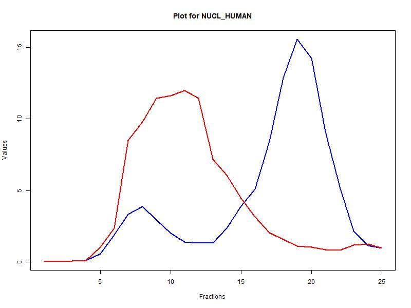

# Proteome-wide Screen for RNA-dependent Protein of non-synchronized HeLa cells

### Baureis, J., Ferdin, J., Nicklas, B., Wintel, L.

##### Supervisors: Prof. Caudron-Heger, M., Pozzi, M.

Welcome to our project in which we used mass-spectrometry data of non-synchronized HeLa cells in order to perform a proteome-wide screen to identify RNA-dependent proteins. XXXGive general introduction into the topic, what our dataset is etc. just like at the beginning of the project proposalXXX

{width="620"}

------------------------------------------------------------------------

### Content of github repository

***Data_set_Version_2:***

This document contains our project code. It is divided into the following sections:

> 1.  Load Dataset
> 2.  Data Cleanup
> 3.  Normalization
> 4.  Identification of local maxima as fit parameters
> 5.  Identification of shoulders
> 6.  Total count of maxima (peaks and shoulders) per protein
> 7.  Identification of proteins with different maxima amount in ctrl vs rnase
> 8.  Criteria for selecting rna-dependent proteins
> 9.  Wilcoxon rank-sum test
> 10. Principle Component Analysis
> 11. k-means clustering
> 12. Linear regression analysis

***Poster:***

This PowerPoint contains the poster for our final presentation.

***Excel table of original data:***

This table shows the original mass spectroscopy data we were given with adjusted delimiter.

***Images:***

This folder contains the plots we used in the poster and the README.

------------------------------------------------------------------------

### Sources

-   [Sternburg et al., Global Approaches in Studying RNA-Binding Protein Interaction Networks, 2020, Trends in Biochemical Sciences.pdf](https://github.com/user-attachments/files/19981693/Sternburg.et.al.Global.Approaches.in.Studying.RNA-Binding.Protein.Interaction.Networks.2020.Trends.in.Biochemical.Sciences.pdf)
-   [Corley et al., How RNA-Binding Proteins Interact with RNA Molecules and Mechanisms, 2020, Molecular Cell.pdf](https://github.com/user-attachments/files/19981705/Corley.et.al.How.RNA-Binding.Proteins.Interact.with.RNA.Molecules.and.Mechanisms.2020.Molecular.Cell.pdf)
-   [Gebauer et al., RNA-binding proteins in human genetic disease, 2020, Nature Reviews Genetics.pdf](https://github.com/user-attachments/files/19981707/Gebauer.et.al.RNA-binding.proteins.in.human.genetic.disease.2020.Nature.Reviews.Genetics.pdf)
-   [Caudron-Herger et al., R-DeeP Proteome-wide and Quantitative Identification of RNA-Dependent Proteins by Density Gradient Ultracentrifugation, 2019, Molecular Cell.pdf](https://github.com/user-attachments/files/19981712/Caudron-Herger.et.al.R-DeeP.Proteome-wide.and.Quantitative.Identification.of.RNA-Dependent.Proteins.by.Density.Gradient.Ultracentrifugation.2019.Molecular.Cell.pdf)
-   [Caudron-Herger-Identification, quantification and bioinformatic analysis of RNA-dependent proteins by RNase treatment and density gradient ultracentrifugation using R-DeeP-2020-Nature Protocols_1.pdf](https://github.com/user-attachments/files/19981715/Caudron-Herger-Identification.quantification.and.bioinformatic.analysis.of.RNA-dependent.proteins.by.RNase.treatment.and.density.gradient.ultracentrifugation.using.R-DeeP-2020-Nature.Protocols_1.pdf)
-   [Rajagopal-Proteome-Wide Identification of RNA-Dependent Proteins in Lung Cancer Cells-2022-Cancers.pdf](https://github.com/user-attachments/files/19981723/Rajagopal-Proteome-Wide.Identification.of.RNA-Dependent.Proteins.in.Lung.Cancer.Cells-2022-Cancers.pdf)
-   [Rajagopal et al., An atlas of RNA-dependent proteins in cell division reveals the riboregulation of mitotic protein-protein interactions. Nat. Commun. 16, 2325 (2025).pdf](https://github.com/user-attachments/files/19981728/Rajagopal.et.al.An.atlas.of.RNA-dependent.proteins.in.cell.division.reveals.the.riboregulation.of.mitotic.protein-protein.interactions.Nat.Commun.16.2325.2025.pdf)

------------------------------------------------------------------------

> For inspiration on writing a comprehensive and engaging README, check out the [Awesome README](https://github.com/matiassingers/awesome-readme?tab=readme-ov-file) repository.
